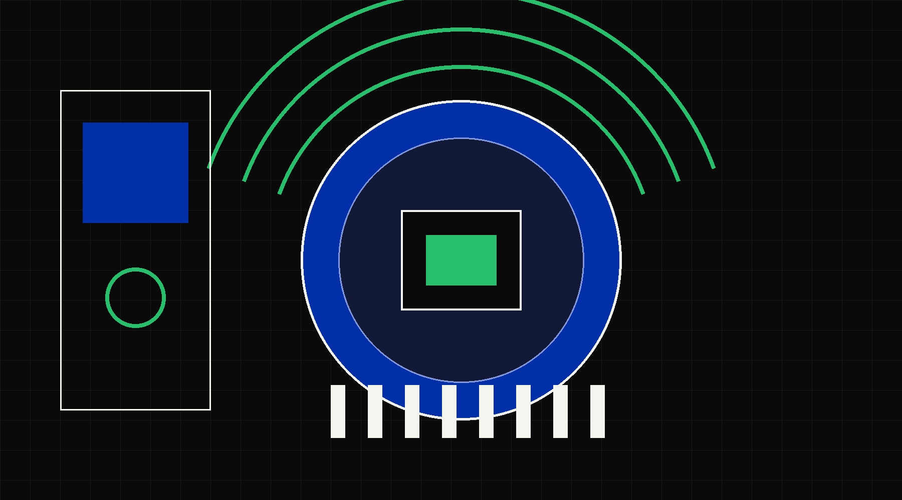
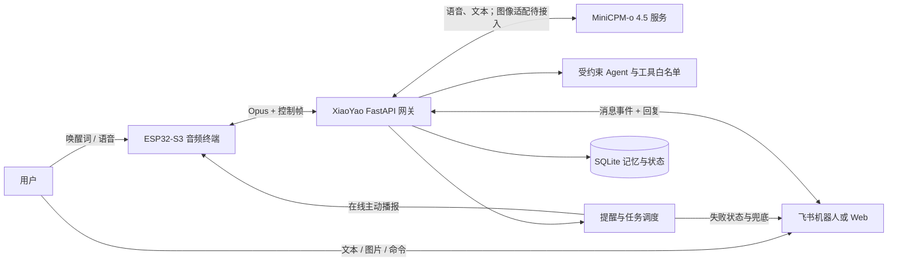

<div align="center">



# XiaoYao 小瑶

### 基于 MiniCPM-o 4.5 的跨终端多模态陪伴智能体

[](https://www.python.org/)
[](https://www.espressif.com/)
[](https://github.com/OpenBMB/MiniCPM-o)
[](LICENSE)

[在线体验](https://xiaoyao.112318.xyz) · [快速开始](#快速开始) · [网关文档](gateway/README.md) · [参与贡献](CONTRIBUTING.md)

</div>

## 项目介绍

XiaoYao 是面向日常陪伴场景的开源智能体。它以 ESP32-S3 音频设备作为常驻语音入口，
通过本地网关连接 MiniCPM-o 4.5，并将语音、飞书、提醒、记忆与图像入口组织为同一套
可追踪的交互流程。用户既可以说“你好小瑶”开始连续对话，也可以在飞书中延续上下文、
创建提醒或管理智能体任务。

项目不把 ESP32 当作一次性语音遥控器：设备负责唤醒、音频采集和播放，网关负责会话、
权限、持久化及任务调度，MiniCPM-o 4.5 负责语言和多模态理解。模型服务与业务层通过
明确接口解耦，可部署在本地或昇腾推理环境中。

## 特色功能

| 功能 | 说明 |
| --- | --- |
| 自然语音陪伴 | 自定义“你好小瑶”唤醒，支持连续问答、明确结束意图与空闲自动退出 |
| 跨渠道上下文 | ESP32 与飞书共享近期对话，用户可在一个终端继续另一个终端的话题 |
| 可控长期记忆 | 重要信息需用户确认后写入 SQLite，支持查看、删除、配额和保留期限 |
| 主动提醒闭环 | 自然语言创建提醒；在线设备主动语音播报，失败时由飞书返回明确状态 |
| 动态 Agent | 将自然语言需求编译为受约束的 AgentSpec，只执行白名单工具，不生成任意代码 |
| 陪伴与生活场景 | 内置陪伴、英语口语练习、服药提醒、工作日天气与出行建议等可组合能力 |
| 单图输入基础 | 手机或网页上传单张图片并绑定一个对话轮次；模型视觉运行时仍需单独接入 |
| 可靠设备链路 | XiaoZhi 兼容 WebSocket/Opus 协议、设备令牌校验、OTA 引导与持久待机通知通道 |

## 系统架构



核心边界：

- **端侧**：唤醒、VAD、Opus 音频和扬声器播放；不保存模型密钥或长期记忆。
- **网关**：统一会话、鉴权、模型适配、任务、飞书和持久化，是主要业务控制面。
- **模型服务**：MiniCPM-o 4.5 通过 HTTP、Realtime 或兼容接口接入；昇腾部署独立于网关。
- **外部渠道**：飞书采用单用户白名单和私聊文本策略，默认关闭群聊与开放式工具执行。

## 快速开始

### 1. 安装网关

```powershell
Set-Location gateway
python -m venv .venv
.\.venv\Scripts\python -m pip install -e ".[test]"
Copy-Item .env.example .env
```

### 2. 配置 MiniCPM-o 4.5

在不会被 Git 跟踪的 `gateway/.env` 中填写实际服务信息：

```dotenv
COMPANION_VOICE_RUNTIME=realtime
COMPANION_MINICPM_O_ENDPOINT=wss://your-ascend-host/v1/realtime?mode=audio
COMPANION_MINICPM_O_AUTH_TOKEN=replace-with-your-runtime-token
```

`realtime` 是 MiniCPM-o 4.5 语音交互的推荐路径；`http` 用于项目定义的 PCM16 包装服务。
接口约定、Mock 和探测步骤见 [网关文档](gateway/README.md) 与
[昇腾部署检查清单](deploy/ascend/README.md)。

### 3. 启动服务

```powershell
$env:PYTHONPATH='src'
.\.venv\Scripts\python -m uvicorn companion_gateway.api:create_default_app `
  --factory --host 0.0.0.0 --port 8723
```

服务启动后可访问：

- `GET /health`：进程存活状态；
- `GET /ready`：数据库等启动依赖的就绪状态；
- `GET /v1/demo/status`：已配置模型和演示通道的脱敏状态；
- `POST /v1/ota`：向受信设备下发 WebSocket 引导配置；
- `WS /v1/devices/ws`：ESP32 音频与控制主链路。

### 4. 运行测试

```powershell
$env:PYTEST_DISABLE_PLUGIN_AUTOLOAD='1'
.\.venv\Scripts\python -m pytest tests
```

## 固件与硬件

当前固件配置面向 Waveshare ESP32-S3 Audio Board，支持自定义唤醒词、AFE/VAD、
WebSocket 音频和 OV2640 摄像头入口。构建脚本会临时注入 OTA 地址，不会把真实地址、
设备令牌或固件备份提交到仓库：

```powershell
.\scripts\build-xiaozhi-waveshare.ps1 -OtaUrl 'https://example.com/ota'
```

详见 [OTA 引导说明](docs/ota-bootstrap.md)。

## 升级说明

当前公开版本将模型配置统一为 `COMPANION_MINICPM_O_*`，并移除了旧的供应商专用运行时
名称。已有部署在更新后必须先迁移未跟踪的 `gateway/.env`，再重启网关；未配置新的
MiniCPM-o 端点和令牌时，应保持 `COMPANION_VOICE_RUNTIME=none`。

## 项目结构

```text
gateway/          FastAPI 网关、模型适配、任务、记忆、飞书与测试
firmware/         XiaoYao 固件公开配置
scripts/          固件构建、网关启动和 Windows 自启动工具
tools/            ESP32、摄像头、MiniCPM-o 与主链路检查工具
deploy/ascend/    昇腾环境探测和 MiniCPM-o 接口验收流程
assets/audio/     由程序生成的非用户音频测试素材
docs/             公开的 OTA 与使用文档
```

## 安全与隐私

仓库不会收录 `.env`、数据库、日志、固件备份、真实设备标识、用户音频或私有验收记录。
密钥必须放在环境变量或密钥管理服务中。记忆、视觉、动态 Agent 和飞书通道默认均可独立
关闭。安全问题请按 [SECURITY.md](SECURITY.md) 私下报告。

## 路线图

- 完善 MiniCPM-o 4.5 在昇腾环境中的部署与性能验收；
- 降低首包语音延迟并增强连续对话的人声门控；
- 扩展摄像头图像理解和手机上传体验；
- 增加可复现的端到端评测与故障注入用例。

## 参与贡献

欢迎提交 Issue 和 Pull Request。开始开发前请阅读 [CONTRIBUTING.md](CONTRIBUTING.md)，
并确保新增功能带有边界清晰的测试，不提交任何密钥、设备信息或用户数据。

## 开源许可

本项目采用 [MIT License](LICENSE)。依赖的第三方项目和模型遵循各自许可证。
